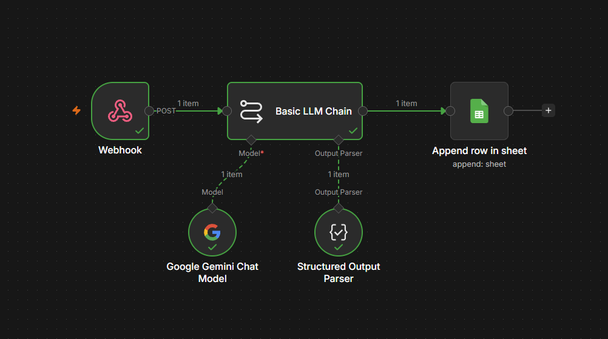
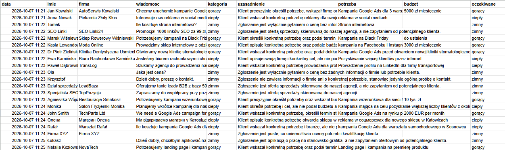
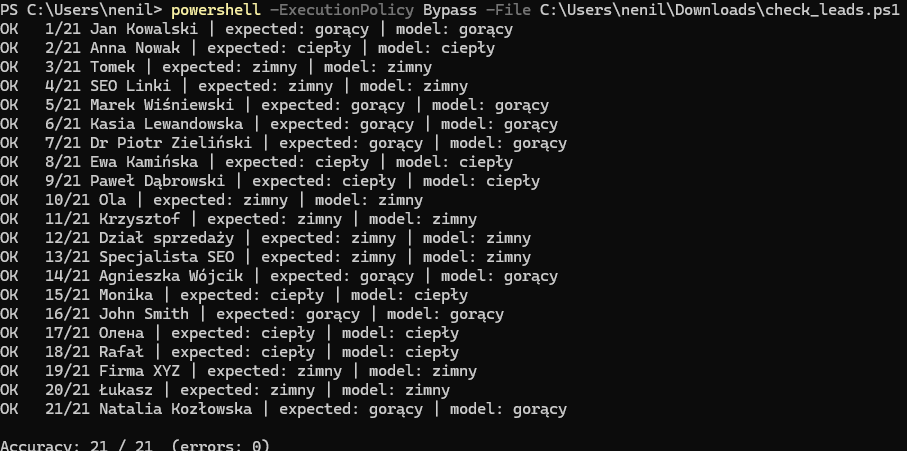

# Kwalifikacja leadów z AI — automatyzacja w n8n

Automatyzacja, która przyjmuje zgłoszenia z formularza kontaktowego, ocenia je modelem językowym (Gemini) i zapisuje wynik w Google Sheets. Handlowiec od razu widzi, które zgłoszenia są gorące, a spam i oferty sprzedaży odpadają automatycznie.



## Jak to działa

1. **Webhook** — przyjmuje zgłoszenie (imię, firma, treść wiadomości) w formacie JSON.
2. **Basic LLM Chain + Gemini** — model ocenia zgłoszenie według reguł zapisanych w prompcie:
   - spam lub oferta sprzedaży skierowana do agencji → **zimny**
   - samo pytanie o cenę, bez informacji o firmie ani celu → **zimny**
   - konkretna potrzeba bez budżetu i terminu → **ciepły**
   - konkretna potrzeba + budżet **lub** termin startu → **gorący**
3. **Structured Output Parser** — wymusza odpowiedź w stałym formacie JSON: `kategoria`, `uzasadnienie`, `firma`, `potrzeba`, `budzet`.
4. **Google Sheets** — każde zgłoszenie trafia jako nowy wiersz do arkusza.



## Testy

Przygotowałem zestaw 21 zgłoszeń testowych z oczekiwaną kategorią, w tym przypadki brzegowe:
- spam i oferty sprzedaży skierowane do agencji,
- same pytania o cenę („Jaka jest cena?”) oraz pytania o cenę z kontekstem firmy,
- wiadomości po angielsku i po ukraińsku,
- puste zgłoszenie i aplikacja o pracę zamiast zapytania.

Skrypt `check_leads.ps1` wysyła wszystkie zgłoszenia do webhooka, porównuje odpowiedź modelu z oczekiwaną kategorią i liczy trafność.

**Wynik: 21/21 na zestawie testowym.**

Uwaga: na tym samym zestawie dopracowywałem reguły w prompcie, więc to wynik na danych testowych, a nie na nowych, niewidzianych zgłoszeniach. Po każdej zmianie promptu uruchamiałem cały zestaw, żeby poprawka jednego przypadku nie psuła innych — tak wyłapałem sytuację, w której zaostrzenie reguły dla „samego pytania o cenę” błędnie oznaczało zgłoszenie piekarni jako zimne.



## Uruchomienie

1. Uruchom n8n w Dockerze:
   ```
   docker run -it --rm --name n8n -p 5678:5678 -v n8n_data:/home/node/.n8n docker.n8n.io/n8nio/n8n
   ```
2. Zaimportuj `workflow.json` (menu workflow → Import).
3. Dodaj własne dane dostępowe: klucz Gemini API (Google AI Studio) oraz Google Sheets OAuth2.
4. Utwórz arkusz z kolumnami: `data, imie, firma, wiadomosc, kategoria, uzasadnienie, potrzeba, budzet, oczekiwane` i wybierz go w węźle Google Sheets.
5. Opublikuj workflow i uruchom testy:
   ```
   powershell -ExecutionPolicy Bypass -File check_leads.ps1
   ```

## Pliki

- `workflow.json` — eksport workflow z n8n (bez kluczy API)
- `check_leads.ps1` — zestaw 21 zgłoszeń testowych i automatyczne sprawdzanie trafności
- `screenshots/` — schemat, wyniki w arkuszu i wynik testów

## Technologie

n8n, Gemini API, Google Sheets API (OAuth2), Docker, PowerShell
